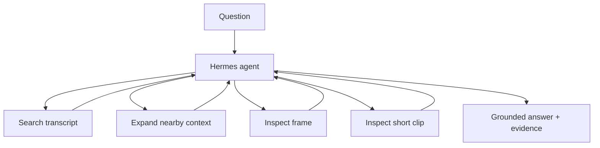

<h1 align="center">Hermes Video Tutor</h1>

<p align="center">
  <strong>A local multimodal video QA agent that decides when transcript evidence is enough — and when it needs to inspect the video.</strong>
</p>

<p align="center">
  
  
  
  
  
</p>

> [!NOTE]
> The interesting part is the **modality decision**: the agent can stop after transcript search, or escalate to frame / clip inspection when the question requires visual evidence.

## Demo

```cmd
run-demo.cmd
```

The Streamlit UI puts the lecture, question, answer, **Agent Activity**, and **Evidence** on one screen.

```text
Q: What color is the highlighted component around 4 seconds?

Hermes
  → search_transcript(...)
  → inspect_frame(4.0)

A: blue [E2]
```

A transcript-answerable question may stop after search. There is no fixed `search → frame → clip` pipeline.

## Measured result

Frozen paired evaluation on **12 local fixture questions** — 6 transcript-answerable and 6 visual-required — using the same Hermes/model setup:

| Condition | Full pass | Visual-required full pass | Visual tool use on visual questions |
|---|---:|---:|---:|
| Transcript only | 16.7% | 0% | 0% |
| **Multimodal tools enabled** | **50.0%** | **66.7%** | **100%** |

On the transcript-answerable cases, multimodal mode made **no unnecessary visual-tool calls** in this frozen run.

Source of truth: [`runs/p3-live-paired-v2/report.json`](runs/p3-live-paired-v2/report.json).

> [!IMPORTANT]
> This is a small product-oriented paired evaluation, not a broad video-QA benchmark claim.

## How it works



The project exposes four domain tools:

- `search_transcript(query, top_k=5)`
- `expand_context(segment_id)`
- `inspect_frame(timestamp_s)`
- `inspect_clip(start_s, end_s)`

Hermes owns the agent loop; the project supplies the tools and evidence contract.

## Engineering choices

- **Adaptive modality** instead of sending every question through visual inspection.
- **Small tool surface**: four tools cover the useful behavior without extra orchestration layers.
- **Bounded clip inspection** using sampled frames from a short range.
- **Evidence-first output** so visual tools return model-usable evidence, not just file paths.
- **Abstention allowed** when the available evidence is insufficient.
- **One `TutorService`** behind Streamlit and CLI.
- **Evaluation labels kept out of runtime inputs**.

## Quickstart

Prerequisites: Git, `uv`, ffmpeg, Ollama, and `qwen3.5:4b`.

### Windows demo

```cmd
run-demo.cmd
```

### CLI

```powershell
video-tutor ask "What are the three stages of the tutor pipeline?"
```

### Inspect activity + evidence

```powershell
.run\app-venv\Scripts\video-tutor.exe inspect --question "What color is the highlighted component around 4 seconds?"
```

## Evaluation note

The historical v1 scorer compared the complete cited response against a short-answer label, so it is not used as a performance claim. V2 separates short-answer correctness from citation validity, modality choice, and evidence-window correctness.

The frozen report also records tool calls, latency, evidence, failure/abstention state, and per-case activity.

## Limits

- The 12-question fixture is self-authored and intentionally small.
- Clip inspection uses sampled frames rather than native long-video input.
- Results depend on the frozen local-model configuration.
- The demo targets lecture-style video rather than arbitrary long-form media.

More detail: [`docs/architecture.md`](docs/architecture.md) · [`docs/hermes-integration.md`](docs/hermes-integration.md) · [`docs/windows.md`](docs/windows.md)
