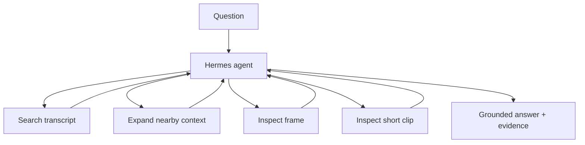

# Hermes Video Tutor

**A local multimodal video QA agent that decides when a lecture question can be answered from the transcript — and when it needs to inspect the video itself.**

Instead of forcing every question through the same pipeline, Hermes chooses among transcript search, nearby-context expansion, frame inspection, and short-clip inspection, then returns an answer with visible source evidence.

## Demo

```cmd
run-demo.cmd
```

The Streamlit demo puts the lecture, question, answer, **Agent Activity**, and **Evidence** on one screen. A visual question can look like this:

```text
Q: What color is the highlighted component around 4 seconds?

Hermes
  → search_transcript(...)
  → inspect_frame(4.0)

A: blue [E2]
```

A transcript-only question may stop after one search. There is no hard-coded `search → frame → clip` sequence.

## Key result

Frozen paired evaluation on **12 local fixture questions** — 6 transcript-answerable and 6 visual-required — using the same Hermes/model setup:

| Condition | Full pass | Visual-required full pass | Visual tool use on visual questions |
|---|---:|---:|---:|
| Transcript only | 16.7% | 0% | 0% |
| **Multimodal tools enabled** | **50.0%** | **66.7%** | **100%** |

On the transcript-answerable cases, multimodal mode made **no unnecessary visual-tool calls** in this frozen run. The project-level verdict is **`KEEP HERMES`**.

Source of truth: [`runs/p3-live-paired-v2/report.json`](runs/p3-live-paired-v2/report.json).

This is deliberately presented as a small product-oriented evaluation, not a broad video-QA benchmark claim.

## How it works



The project exposes four domain tools:

- `search_transcript(query, top_k=5)`
- `expand_context(segment_id)`
- `inspect_frame(timestamp_s)`
- `inspect_clip(start_s, end_s)`

Hermes owns the agent loop; the project supplies the tools and evidence contract.

## What the UI shows

- the lecture video
- the user question
- final answer with evidence IDs
- which tools the agent called
- short activity summaries
- transcript or visual evidence used for the answer

The UI exposes tool activity and evidence without exposing hidden chain-of-thought.

## Quickstart

Prerequisites: Git, `uv`, ffmpeg, Ollama, and `qwen3.5:4b`.

Windows:

```cmd
run-demo.cmd
```

CLI:

```powershell
video-tutor ask "What are the three stages of the tutor pipeline?"
```

Inspect tool activity and evidence:

```powershell
.run\app-venv\Scripts\video-tutor.exe inspect --question "What color is the highlighted component around 4 seconds?"
```

The Streamlit UI and CLI use the same `TutorService`.

## Engineering choices

- **Small tool surface.** Four tools are enough to express the useful agent behavior.
- **Adaptive modality.** Visual inspection is available when needed instead of being mandatory for every question.
- **Bounded video inspection.** Clip inspection samples frames from a short range rather than sending arbitrary-length video.
- **Evidence-first output.** Frame/clip tools return visual content to the model, not only file paths.
- **Abstention is allowed.** The tutor can decline when the available evidence is insufficient.
- **Evaluation labels stay out of runtime inputs.** Reference answers are kept separate from the agent path.

More detail: [`docs/architecture.md`](docs/architecture.md), [`docs/hermes-integration.md`](docs/hermes-integration.md), and [`docs/windows.md`](docs/windows.md).

## Evaluation notes

The historical v1 scorer compared the complete cited response against a short-answer label, so it is intentionally not used as a performance claim. V2 separates short-answer correctness from citation validity, modality choice, and evidence-window correctness.

The frozen report also records tool calls, latency, evidence, failure/abstention state, and per-case activity.

## Limitations

- The 12-question fixture is self-authored and too small for broad video-QA claims.
- Clip inspection uses sampled frames rather than native long-video input.
- Results depend on the frozen local-model configuration.
- The demo is designed around lecture-style video rather than arbitrary long-form media.

## Development

```bash
python -m pytest -q
python -m compileall -q src evaluation tests
```
