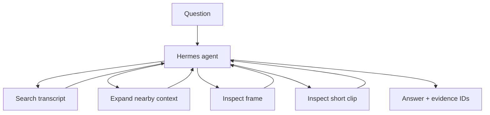

<h1 align="center">Hermes Video Tutor</h1>

<p align="center">
  <strong>A local multimodal video QA agent that can decide when transcript evidence is enough — and when it needs to inspect the video.</strong>
</p>

<p align="center">
  
  
  
  
  
</p>

<p align="center">
  <a href="#demo">Demo</a> ·
  <a href="#key-result">Key result</a> ·
  <a href="#how-it-works">Architecture</a> ·
  <a href="#quickstart">Quickstart</a>
</p>

## At a glance

| | |
|---|---|
| **Problem** | Transcript-only QA fails when the answer is visible in a frame or clip rather than spoken. Sending every question to a vision model is wasteful. |
| **What I built** | A local agent with four video tools that can stop after transcript search or use frame / clip inspection when needed. |
| **Evidence** | On a frozen 12-question fixture, multimodal mode reached **66.7% strict full pass on visual-required questions** and used a visual tool on **100% of those questions**. |
| **Design focus** | Adaptive modality, visible tool activity, and answers tied to inspectable evidence IDs. |

> [!NOTE]
> The interesting part is not “LLM + video.” It is the **modality decision**: when should the agent use text, and when should it inspect the video?

## Demo

```cmd
run-demo.cmd
```

The Streamlit UI keeps the lecture, question, answer, **Agent Activity**, and **Evidence** together on one screen.

A typical visual-required question can look like this:

```text
Q: What color is the highlighted component around 4 seconds?

Hermes
  → search_transcript(...)
  → inspect_frame(4.0)

A: blue [E2]
```

A transcript-answerable question can stop after search. There is no fixed `search → frame → clip` pipeline and the runtime does not hard-code a visual trigger.

## Key result

Frozen paired evaluation on **12 local fixture questions** — 6 transcript-answerable and 6 visual-required — using the same Hermes/model setup:

| Condition | Strict full pass | Visual-required strict full pass | Visual tool use on visual questions |
|---|---:|---:|---:|
| Transcript only | 16.7% | 0% | 0% |
| **Multimodal tools enabled** | **50.0%** | **66.7%** | **100%** |

On transcript-answerable cases, multimodal mode made **no unnecessary visual-tool calls** in this frozen run.

Source of truth: [`runs/p3-live-paired-v2/report.json`](runs/p3-live-paired-v2/report.json).

> [!IMPORTANT]
> This is a small, **self-authored** product-oriented paired evaluation, **not a broad video-QA benchmark claim**. V2 uses a strict `FINAL: <short answer> [E#]` contract; its full-pass metric is a protocol score, not human semantic-equivalence accuracy.

### Evaluator-remediation diagnostic

A later review found that the frozen v2 evaluator treated harmless output-format variants and short declarative wrappers as failures. The parser/evaluator now accepts grouped citations such as `[E1, E2]`, harmless trailing punctuation, and bounded non-negated declarative wrappers such as `The project codename is Orion` for the short answer `Orion`. Ambiguous forms such as `Orion or Atlas` or `green and blue` are deliberately rejected.

Re-scoring the **preserved raw model outputs from the same v2 run** under that corrected conservative contract gives:

| Condition | Post-hoc full pass | Transcript cases | Visual-required cases |
|---|---:|---:|---:|
| Transcript only | 6 / 12 | 6 / 6 | 0 / 6 |
| Multimodal tools enabled | **11 / 12** | **6 / 6** | **5 / 6** |

This is a **post-hoc diagnostic, not a fresh benchmark run**. It quantifies how much the old output contract compressed the frozen result; it is not promoted over the original v2 source-of-truth score until the frozen live evaluation is rerun end to end.

## How it works



The project exposes only four domain tools:

| Tool | Purpose |
|---|---|
| `search_transcript(query, top_k=5)` | Find spoken evidence relevant to the question and expose segment IDs for follow-up expansion. |
| `expand_context(segment_id)` | Pull nearby transcript context around a search hit. |
| `inspect_frame(timestamp_s)` | Inspect a single visual moment. |
| `inspect_clip(start_s, end_s)` | Inspect a short range when one frame is insufficient. |

Hermes owns the agent loop; this repository supplies the domain tools, evidence contract, product UI, and evaluation harness.

### Why this project

Video QA is often presented as “send the video to a multimodal model.” This project asks a narrower systems question: **can a local agent choose a useful modality while keeping the evidence visible?** The agent can search transcript evidence, inspect frames or clips when useful, return evidence IDs with the answer, and abstain when evidence is insufficient.

## What the UI shows

- lecture video + user question
- final answer with evidence IDs
- which domain tools the agent called
- short activity summaries
- transcript or visual evidence associated with the answer
- failure / abstention behavior when evidence is insufficient

The UI exposes tool activity and evidence without exposing hidden chain-of-thought.

## Quickstart

Prerequisites: Git, `uv`, ffmpeg, Ollama, and `qwen3.5:4b`.

### Windows demo

```cmd
run-demo.cmd
```

### CLI

```powershell
video-tutor ask "What are the three stages of the tutor pipeline?"
```

### Inspect activity + evidence

```powershell
.run\app-venv\Scripts\video-tutor.exe inspect --question "What color is the highlighted component around 4 seconds?"
```

## Engineering choices

- **Adaptive modality** instead of sending every question through visual inspection.
- **Small tool surface**: four domain tools cover the useful behavior without extra orchestration layers.
- **Bounded clip inspection** using sampled frames from a short range.
- **Evidence-first tool outputs** so visual inspection returns model-usable evidence, not only file paths.
- **Abstention allowed** when evidence is insufficient.
- **One `TutorService`** behind Streamlit and CLI.
- **Evaluation labels kept out of runtime inputs**.

## Evaluation notes

The historical v1 scorer compared the complete cited response against a short-answer label and is not used as the current performance claim. V2 separates short-answer correctness from citation validity, modality choice, and evidence-window correctness.

The corrected evaluator accepts a deliberately bounded set of deterministic equivalent forms; it does not use an LLM judge or claim open-ended semantic equivalence.

The evaluator requires the cited evidence satisfying the required modality to overlap the expected evidence window. A wrong-time visual citation therefore cannot pass merely because a separate transcript citation falls inside the window.

The frozen report also records tool calls, latency, evidence, failure / abstention state, and per-case activity. See [`evaluation/README.md`](evaluation/README.md) for the exact scoring boundary and historical v1/v2 distinction.

## Limitations

- The 12-question fixture is **self-authored** and intentionally small.
- The 11/12 remediation number is a post-hoc re-score of preserved raw outputs, not a fresh run.
- Clip inspection uses sampled frames rather than native long-video input.
- Results depend on the frozen local-model configuration.
- The demo targets lecture-style video rather than arbitrary long-form media.

More detail: [`docs/architecture.md`](docs/architecture.md) · [`docs/hermes-integration.md`](docs/hermes-integration.md) · [`docs/windows.md`](docs/windows.md)